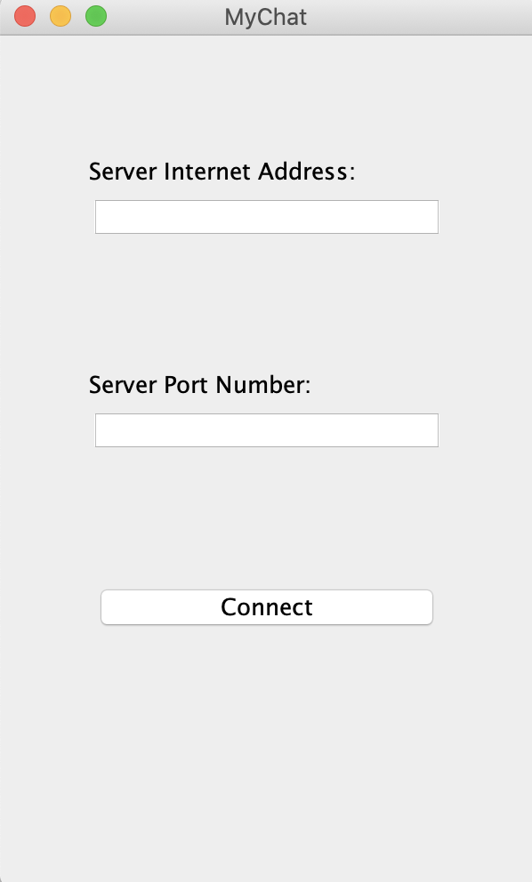
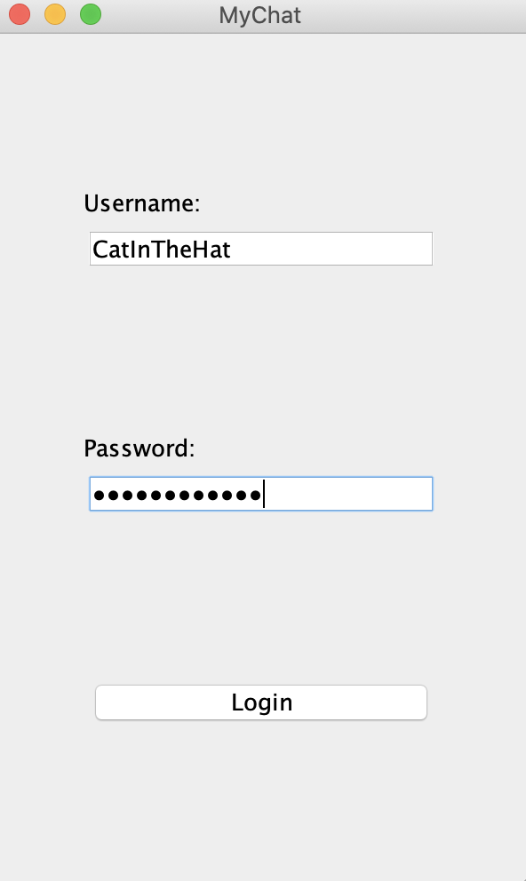
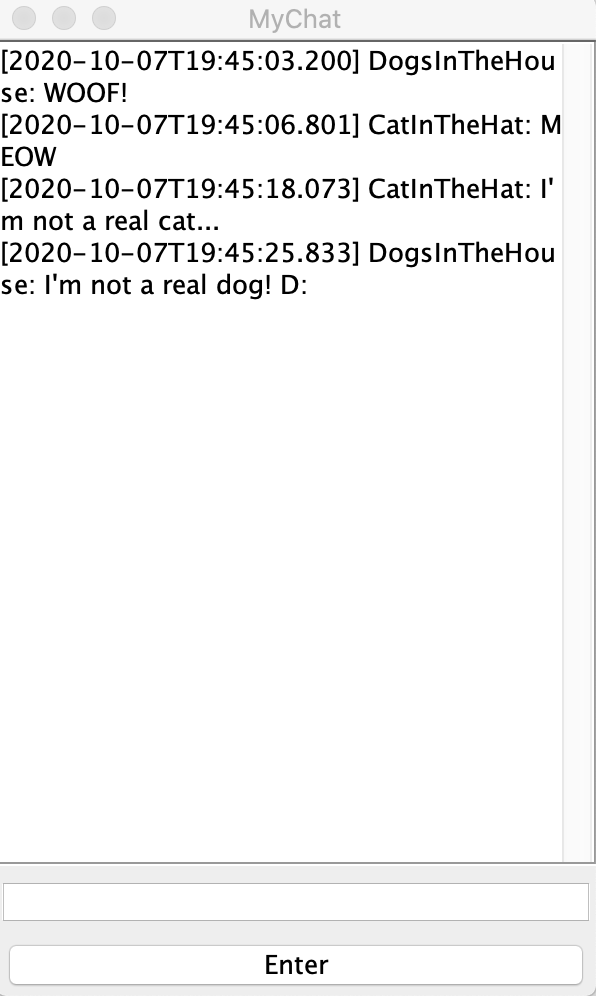
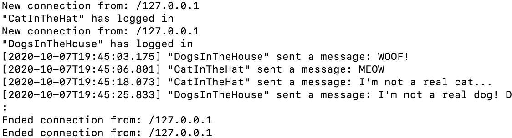

# chat
Chat. In Java. Enjoy.

## How to Compile and Run
I'm not entirely sure how to compile this one (the client, at least) from the command line; you'll have to use IntelliJ for a simple compile. Otherwise, I'm afraid you're on your own on how to compile this from just the command line. Apologies.

Once you've compiled it in IntelliJ, you can run the server from the command line by `cd`ing into the `chat/out/production/chat` folder and running:
```
java server/Server
```
You can similarly run a client by `cd`ing into `chat/out/production/chat`, but this time running:
```
java server/Client
```

Alternatively, you can run either program from the precompiled JARs that are included. You'll have to trust that I simply non-maliciously compiled the program in IntelliJ and converted it to a JAR, though. To do so, run `cd` into the `chat` directory and run either:
```
java -jar Server.jar
```
or
```
java -jar Client.jar
```
depending on whether you want to run a server or client, respectively.

##FYIs
The server is preconfigured to run on port 8080. To change this, you'll have to mess around in the source code, particularly `chat/src/server/Server.java`.

The client, on the other hand, will prompt you to enter the IP address and port of a known server. It will not automatically assume that the server is on port 8080.

The client will also prompt you to enter in a username and password, but the server does not verify these values. It only uses the username to notify the client of a user's chosen display name for the duration of their connection to the server. You'll again have to muck about in the source to change this behavior. You might want to look into adding verification features to `chat/src/server/Server.java`. Maybe you might work the code to use an external database to store the password (after hashing it, of course); that's up to you.

Anyway, I hope you enjoy this project. As always, if something goes catastrophically wrong, please don't sue me. Thanks. And cheers! Enjoy.

Here are some example photos of what the client looks like:



The connection page. You enter in the server's IP and port here first.



The login page. You enter a username (and superfluous) password here.



The chat box. You chat here after connecting to a server and logging in.

Finally, here are some example photos of the server logging actions by clients:

